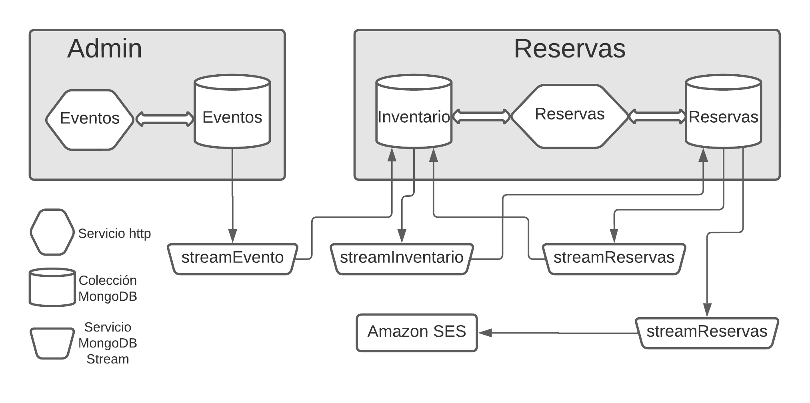

## Nueva prueba de concepto: Boletia, una aplicación para venta de boletos,  basada en microservicios event-driven (ahora con MongoDB Stream).

**Desarrollada sobre Kubernetes, un cluster MongoDB Atlas y MongoDB Streams para comunicación entre servicios.**



En repositorios anteriores realizamos la prueba de concepto de la aplicación Boletia en dos ambientes:

- Servicios serverless de Amazon Web Services,  Api Gateway, Lambda, DynamoDB, DynamoDB Streams y Cognito: https://github.com/avaco2312/boletia-aws

- Kubernetes con Kafka, MongoDB y MongoDB Kafka Connect: https://github.com/avaco2312/boletia-kubernetes-kafka-mongodb 

Aquí haremos una implementación donde los microservicios correrán en un cluster Kubernetes, pero la base de datos estará soportada en un servicio externo, un cluster MongoDB Atlas.

La comunicación entre los servicios estará basada en el uso de MongoDB Streams, en lugar de Kafka. Por cierto, la base de la interacción entre MongoDB y Kafka, MongoDB Kafka Connect, que usamos en el segundo proyecto mencionado, se construye utilizando MongoDB Streams.

Reducimos la exposición, sobre la base de lo documentado en los proyectos anteriores, y expondremos principalmente lo que es nuevo a esta implementación. El modelo es el mismo: una aplicación constituida por microservicios (sólo el backend) y que implementa, de forma simplificada, la venta de boletos para eventos (conciertos, teatro, eventos deportivos, etc). 

El lanzamiento del repositorio en Kubernetes (usando Kind) se realiza mediante el archivo comandos.bat, que hace el deploy de clientes.yaml e ingress.yaml. Previamente debemos tener acceso a un cluster de MongoDB Atlas, el cual es posible obtener de forma gratuita para fines de estudio. En clientes.yaml se debe agregar la cadena de conexión a este cluster.

Hay dos microservicios "de cara" al usuario: Eventos y Reservas (imágenes docker seventos y sreservas), y cuatro microservicios "de fondo": streamEvento, streamInventario, streamReserva y streamNotificacion (imágenes docker ssevento, ssinventario, ssreserva, ssnotificacion) . 

Las imágenes Docker se construyen corriendo make.bat en los respectivos directorios.

Empecemos por los microservicios "de cara al usuario". Al igual que en las implementaciones anteriores sólo se hacen inserciones o updates en las colecciones (no se hace delete de registros existentes).

El microservicio eventos está vinculado a tareas de administración y, en la vida real, incluiría muchos otros aspectos como, por ejemplo, contratos, locales, personal, etc.

El cliente "eventos" escucha internamente en el puerto 8070 y, mediante Ingress en el cluster kubernetes, es accesible en localhost/eventos. Permite crear, ver y cancelar eventos, en la colección eventos.

Podemos crear un evento mediante:

```code
curl -X POST http://localhost/eventos
-d '{
        "nombre":   "Opera Boheme",
        "capacidad": 20,
        "categoria": "Opera"
    }'

HTTP/1.1 200 OK
Date: Mon, 22 Jul 2022 22:37:05 GMT
Content-Type: text/plain; charset=utf-8
Content-Length: 126
Connection: close

{
  "Id": "619c1b9190812c00013e29c1",
  "Nombre": "Opera Boheme",
  "Capacidad": 20,
  "Categoria": "Opera",
  "Estado": "A"
}
```
Podemos consultar el evento creado con:
```code
curl -X GET http://localhost/eventos/Opera%20Boheme

HTTP/1.1 200 OK
Date: Mon, 22 Jul 2022 22:38:28 GMT
Content-Type: application/json;charset=utf8
Content-Length: 106
Connection: close

{
  "Id": "619c1b9190812c00013e29c1",
  "Nombre": "Opera Boheme",
  "Capacidad": 20,
  "Categoria": "Opera",
  "Estado": "A"
}
```

También podemos hacer la cancelación de un evento (http delete). Aquí realmente se hace un update del estado del evento y se pasa de "A" (activo) a "C" (cancelado).

Los detalles de los servicios Eventos y Reservas pueden verse en los repositorios citados.

Los servicios "de fondo" "escuchan" los cambios realizados por los usuarios en las colecciones de la base de datos y actualizan convenientemente otras colecciones (aunque aquí son colecciones de la misma base de datos boletia, pudieran ser colecciones ubicadas en otras bases de datos o incluso en diferentes clusters MongoDB).

Por ejemplo, el microservicio "de fondo" streamEvento escucha los cambios de tipo insert y update que se hagan en la colección eventos, y en cada caso, actualiza la colección inventarios. 

Al recibir la inserción de un evento, realiza la inserción de un documento similar en la colección inventario. El campo capacidad en la colección eventos se cambia de nombre, a disponible, en la colección inventario, que es la usada para manejar las reservas.

Al insertar el evento en eventos, podemos de inmediato consultar el documento duplicado en inventario:

```code
curl -X GET http://localhost/reservas/inventario/Opera%20Boheme

HTTP/1.1 200 OK
Date: Mon, 22 Jul 2022 23:38:28 GMT
Content-Type: application/json;charset=utf8
Content-Length: 106
Connection: close

{
  "Id": "619c1b9190812c00013e29c1",
  "Nombre": "Opera Boheme",
  "Disponible": 20,
  "Categoria": "Opera",
  "Estado": "A"
}
```

En el caso de un update el único posible, de acuerdo a lo implementado, es cancelar el evento. Esto se propaga al inventario, donde también el estado pasa de "A" a "C". Otro servicio de fondo, streamInventario propagará el cambio en inventario a todas las reservas existentes para ese evento, poiéndolas en estado "C" (evento cancelado"). Y a su vez este cambio en esas reservas disparará el servicio streamNotificacion que enviará una notificación por email informando al usuario de la cancelación.

De inicio cada servicio de fondo crea un cliente MongoDB y se conecta a la base de datos. También define la colección a cuyo stream de cambios se conectará y la colección o colecciones que modificará al recibir un cambio. También define una función, que llamamos "procesa" en los ejemplos, encargada de efectuar esos cambios.

Para monitorear la colección eventos, el servicio streamEvento crea una conexión MongoDB Stream a esa colección. Especifica los cambios que desea le reporten. Llama para ello a la función ConnectStream definida en el paquete auxiliar "streams":  

```code
 func ConnectStream(ctx context.Context, client *mongo.Client, stream, collection string, pipeline *mongo.Pipeline, procesa procFunction)
```

A esta función se proporciona:

- el cliente MongoDB, previamente creado por el servicio
- el nombre que le da el servicio a este stream
- la colección cuyos cambios se monitorean
- el pipeline, que permite filtrar esos cambios y que sólo se reporten los de interés para el servicio
- una función que se llamará cuando se produzca un cambio de interés.

Sobre estos parámetros:

- Dar un nombre al stream permitirá que varios servicios de fondo monitoreen la misma colección con diferentes criterios y diferentes nombre de stream. Más adelante lo detallamos.
- El pipeline de streamEvento es:
  
```code
	pipeline := mongo.Pipeline{
		bson.D{{Key: "$match",
			Value: bson.D{{Key: "operationType",
				Value: bson.D{{Key: "$in",
					Value: bson.A{"insert", "update"},
				}},
			}},
		}},
		bson.D{{Key: "$addFields",
			Value: bson.M{"fullDocument.disponible": "$fullDocument.capacidad"},
		}},
```
- Con este pipeline se garantiza que sólo se reciban los cambios asociados a un insert o un update. También copia el cambo capacidad en un nuevo campo llamado disponible (el campo capacidad se elimina al insertar posteriormente el documento en la colección inventario).
- Proporcionamos la función que queremos se ejecute cada vez que se detecte un cambio, que hemos llamado procesa. Al ser disparada nos trae como parámetros un documento que representa el cambio detectado y un token que identifica de manera única este cambio. Nuestra implementación de ConnectStream hace que el documento devuelto contenga el evento cambiado tal y como quedó después de la modificación.
- En base a este documento podemos realizar dentro de la función proporcionada los cambios necesarios en otras colecciones. En el caso de streamInventario, por ejemplo, cuando recibe un insert, inserta un documento en la colección inventario, idéntico al de la colección eventos, salvo el campo capacidad cambiado a disponible.

Comentemos la función ConnectStream. 

Como mencionamos, cada cambio que se detecte por un MongoDB Stream lleva asociado un token único que lo identifica. Después de procesar un cambio, ConnectStream guarda ese token en una colección llamada stream, junto con el nombre del stream que lo reporta. Al comenzar, se recupera este token. Si no existe, significa que es la primera vez que se empiezan a monitorear los cambios. De existir un token guardado, se le pide a MongoDB que reporte sólo los cambios registrados después de ese token, sin repetir los ya procesados, garantizando no se procese un cambio más de una vez (en condiciones de funcionamiento normales).

Esto también garantiza que cada cambio de interés se detecte al menos una vez aunque, como veremos, se puede dar el caso de que se detecte más de una (cuando se produce un fallo externo).

El código asociado:

```code
	optStream := options.ChangeStream().SetFullDocument(options.UpdateLookup)
	if _, ok := mToken["token"]; ok {
		token := mToken["token"].(string)
		optStream = optStream.SetStartAfter(bson.M{"_data": token})
	}
```

Indica, como opciones del stream, que devuelva el documento completo, ya modificado (si no se indica, los updates sólo devuelven los campos que cambiaron). Si se encontró un token guardado, que reporte los cambios que ocurran, o ocurrieron,  después del asociado a ese token.

A partir de ahí comienza un ciclo donde al producirse un cambio se llama a la función que suministramos. Esta procesa lo que se necesite y si retorna sin error, se salva el token y se pasa a esperar el siguiente cambio.

Este mecanismo es de "no retorno". Si se produce un error, que sólo es posible por condiciones anormales, como fallos en la red, la base de datos "caída", etc., el servicio de fondo aborta, termina su ejecución. En un breve lapso el deployment de Kubernetes lo reinicia y comenzará a procesar los cambios a partir del cambio siguiente al último token guardado (que es el último cambio completamente procesado).

La función que se llama para cada cambio, que hemos llamado procesa, realiza los cambios que necesitemos. En el caso del servicio streamEvento:

- Si es un insert, inserta un documento en inventario.
- Si es un update, una cancelación (estado del evento pasa de "A" a "C"), cambia el estado en inventario de "A" a "C" (evento cancelado).

Brevemente la lógica para los otros servicios de fondo:

streamInventario: 

- Cuando se hace una reserva mediante el servicio Reservas, se disminuye la cantidad disponible en el inventario del evento, y se registran adicionalmente los datos de la reserva (email del usuario, cantidad). streamInventario captura este cambio e inserta un documento en la colección Reservas (la reserva como tal).
- Cuando en el servicio Eventos se cancela un evento, streamEvento propaga la cancelación al inventario. Este cambio en inventario lo captura streamInventario y cancela todas las reservas existentes para ese evento (pasa su estado de "A" a "C").

streamReserva:

- Cuando el usuario cancela una reserva, esta se pasa de estado "A" a "X" (reserva cancelada). streamReserva captura el cambio e incrementa el disponible del inventario con el número de boletos que tenía la reserva cancelada.

streamNotificacion: 

- Captura todos los cambios que se hacen a una reserva, insert (estado "A") o update (estado "C" o estado "X"). Envía un mensaje al email del usuario, informando el estado de la reserva. Para ello utiliza el servicio externo de Amazon SES. Para que funcione es necesario definir el email desde que se enviarán las notificaciones, en clientes.yaml (SENDER_EMAIL). Este email debe estar definido en AWS SES. Los datos de la cuenta AWS deben ubicarse en el directorio "clientes-go\streamNotificacion\.aws\credentials" (archivos config y credentials). En un caso real posiblemente estos valores se protegerían usando, por ejemplo, AWS Secret Manager. Los email que envía streamNotificacion son:

```code
Su reserva 62f19bcf2e1846ad8f7ac000 de 2 boletos para el evento Opera Rigoletto está confirmada

Su reserva 62f19fc32e1846ad8f7ac007 de 4 boletos para el evento Stairway to Heaven fue cancelada a petición suya

Su reserva 62f1a0db2e1846ad8f7ac008 de 4 boletos para el evento Opera Aida fue cancelada, el evento fue suspendido por los organizadores
```

Queda un tópico sumamente importante: Idempotencia. Guardando el token de cada cambio que llega a un servicio de fondo garantizamos que, en circunstancias extraordinarias de interrupción del servicio, este se reanude (mediante su definición como deployment en kubernetes) y se recomience con el cambio siguiente al último completado.

Pero en circunstancias extraordinarias (fallo de la red, de la base de datos, etc.) puede pasar que se hagan los cambios en la base de datos y no se termine el ciclo de MongoDB Stream. En este caso, al reiniciarse el servicio, nos enviaría el mismo cambio que ya fue procesado y salvado en la base de datos.

El mecanismo para no duplicar un cambio, cuando esta situación sucede, es garantizar que los cambios que realiza el servicio de fondo, en la función procesa, sean idempotentes. Esto es, que si un cambio llega más de una vez, el resultado de efectuarlos sea el mismo que si sólo llegara una vez.

Esto a veces es fácil de implementar, de acuerdo a las características del cambio a realizar. Por ejemplo, si se realiza un insert que incluye una clave primaria, como es el caso de streamEvento. El código del insert que se realiza en inventario, en la función procesa:

```code
	case "insert":
		inventario.Id = primitive.NewObjectID()
		_, err = collInventario.InsertOne(ctx, &inventario)
		if err != nil && !mongo.IsDuplicateKeyError(err) {
			return err
		}
```

Como tenemos definido un índice único por el campo nombre, de la colección inventario, de llegar el mismo cambio la inserción falla y no se repite. Observe que en el manejo del error vemos si es el caso de un nombre duplicado. En ese caso la función procesa en sí no falla, lo que hace que se complete el proceso de MongoDB Stream, se guarda el token y se espera por el siguiente cambio.

En algunos casos también se obtiene fácilmente la idempotencia, aún cuando no intervengan claves primarias. Es el caso del update en stream Evento, procesado también por la función procesa:

```code
	case "update":
		filter := bson.D{
			{Key: "nombre", Value: inventario.Nombre},
			{Key: "estado", Value: "A"},
		}
		update := bson.M{"$set": bson.M{"estado": "C"}}
		res := collInventario.FindOneAndUpdate(ctx, filter, update)
		err = res.Err()
		if err != nil && err != mongo.ErrNoDocuments {
			return err
		}
	}
	return nil
```

Aquí recibimos el cambio de un evento a estado cancelado "C" y lo propagamos al inventario correspondiente (pasa a estado "C"). Cómo ponemos como condición que este inventario corresponda al evento y que esté además en estado "A", de llegar repetida una cancelación sólo se realiza una sola vez (el primer cambio ya lo pone en "C" y las restantes veces ya no será elegible).

Pero a veces no es posible garantizar la idempotencia de forma "natural" y tenemos que crear mecanismos para lograrla. Es el caso de streamReserva, cuyo stream se define con:

```code
	pipeline := mongo.Pipeline{
		bson.D{{Key: "$match",
			Value: bson.D{{Key: "$and",
				Value: bson.A{
					bson.D{{Key: "operationType", Value: "update"}},
					bson.D{{Key: "fullDocument.estado", Value: "X"}},
				},
			}},
		}},
	}
```

Esto define que sólo recibimos los cambios en reservas que corresponden a un update y que pusieron el estado en "X". Esto es, recibimos las cancelaciones de reserva hechas en el servicio Reservas.

En base a ello debemos modificar el correspondiente evento en el inventario, aumentando su disponibilidad en el número de boletos de la reserva cancelada, lo hacemos con:

```code
	filter := bson.D{
		{Key: "nombre", Value: reserva.Evento},
		{Key: "estado", Value: "A"},
		{Key: "token", Value: bson.D{{Key: "$ne", Value: token}}},
	}
	update := bson.D{
		{Key: "$inc",
			Value: bson.D{
				{Key: "disponible", Value: reserva.Cantidad},
			},
		},
		{Key: "$set",
			Value: bson.D{
				{Key: "token", Value: token},
			},
		},
	}
```

La función procesa, además de los datos de la reserva cancelada, recibe el token asociado a ese cambio. Al hacer el update, además de incrementar la disponibilidad en el inventario, guardamos el token en el documento. Y para realizar el update se pide que el token actual no coincida con el guardado (si existiera). Luego, la primera vez que llega un cambio, se realiza el update (el token actual es diferente del token guardado, que, o no existe, o corresponde a un cambio anterior). De volver a llegar el mismo cambio, los token actual y guardado coinciden y no se vuelve a realizar el update.

Y por último, hay veces que no nos interesa que el servicio de fondo sea idempotente, o esto no es realmente importante. Es el caso de streamNotificacion dónde, de producirse un fallo excepcional, el resultado es que el usuario recibe una notificación repetida. Usamos aquí la técnica "del avestruz", dejamos que esto (excepcionalmente) suceda.
